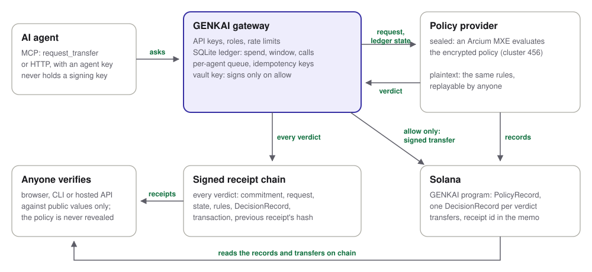

# GENKAI

[](https://github.com/let-the-dreamers-rise/clawshield-core/actions/workflows/ci.yml)
[](https://github.com/let-the-dreamers-rise/clawshield-core/actions/workflows/image.yml)
[](https://github.com/let-the-dreamers-rise/clawshield-core/actions/workflows/codeql.yml)
[](https://github.com/let-the-dreamers-rise/clawshield-core/releases)
[](https://genkai-inky.vercel.app)
[](LICENSE)

**Confidential, verifiable authority for AI agents that move money on Solana.**

An agent proposes a transfer. A deterministic policy engine - never the model - decides. Every
decision, including every refusal, emits a signed receipt a third party can verify without
trusting the operator. And with GENKAI the policy itself can stay encrypted: it is evaluated on
ciphertext by an [Arcium](https://arcium.com) MPC cluster, so the limits that *are* a desk's
strategy are never published to enforce them.

Built on `clawshield-core`. Zero runtime dependencies: Ed25519, SHA-256, base58, the Solana wire
format, JSON-RPC and the HTTP verifier are all implemented on `node:crypto` and Node built-ins,
because a supply-chain compromise anywhere on the path from decision to signature would
invalidate every receipt ever issued.

```
221 tests  |  97% line coverage  |  0 runtime dependencies  |  tsc --strict clean
```

## Live on Solana devnet

**Verify it yourself: [genkai-inky.vercel.app](https://genkai-inky.vercel.app).** One click checks
five decisions the Arcium cluster took on devnet for an agent of the GENKAI gateway, in your
browser, against the records on chain: two transfers allowed and landed, two denied, one
escalated. Another click shows a forged approval being caught.

The gateway ran from its published container image (digest in
[`run.json`](examples/devnet/gateway/run.json)) in sealed, broadcast mode. Each decision took 5 to
38 seconds end to end, median 7.6, the MPC evaluation included.

| | |
|---|---|
| GENKAI program | [`AwiVMGyi8P9mN6ig5FA74CTS6sncc7bbh8CNAxKXUERk`](https://explorer.solana.com/address/AwiVMGyi8P9mN6ig5FA74CTS6sncc7bbh8CNAxKXUERk?cluster=devnet) |
| Sealed PolicyRecord | [`4GAuWFqwJLhEqLAguJV3cdrwYWHc3yKP4QnYVkwWQRKL`](https://explorer.solana.com/address/4GAuWFqwJLhEqLAguJV3cdrwYWHc3yKP4QnYVkwWQRKL?cluster=devnet) |
| Policy commitment | `d5987b971868601cf6845a3b9b3a95fad90c056a306e3addc45d43b540890df1` |
| Arcium cluster | offset 456, circuit `genkai.policy.v2` |
| Decisions by the cluster | [allow](https://explorer.solana.com/address/892E1Gutdd3fk248aoKYTMvGfairBjToUumNV2onBk84?cluster=devnet), [deny](https://explorer.solana.com/address/51nFcVZxuTYwAMWgYWHwt23kGm2aRW7ELaj2ZN3aJqiT?cluster=devnet), [escalate](https://explorer.solana.com/address/8nQjNiQJ3xBPGRKaRPLqn9p39W1zbMSKeQEXxxdno9Bf?cluster=devnet), [deny](https://explorer.solana.com/address/J88FDgrZGTh6UXbKG27zWTy47n6N78YK7ob9gVof6Lo1?cluster=devnet), [allow](https://explorer.solana.com/address/UU6Jz4ytWnZw81Um4uxxfiUPZgZFhNhJrzaugcX9Xj7?cluster=devnet) |
| Transfers that landed | [0.01 SOL](https://explorer.solana.com/tx/5axning5vhZ6PTx7Nhw3WyPpBAYjPgNQetaCT7Fq5D9kdW2xTspMMpxvQ8sEj47uGYFrGH5ANWyHEhqJW5oYU3wc?cluster=devnet), [0.015 SOL](https://explorer.solana.com/tx/2NJoEc4CmAy5MyDWkFmwigVZ7hWKPUCZFspYHazhb18SC7A2QNwFA7m414zVwYsma7GSpghBSznfJPtH3NouULgA?cluster=devnet), each with the receipt id in its memo |
| USDC run, through MCP | PolicyRecord [`3iBdFt2rSE66nJhpagxniYZrYLbPXcF5QyT3rcUtVEYo`](https://explorer.solana.com/address/3iBdFt2rSE66nJhpagxniYZrYLbPXcF5QyT3rcUtVEYo?cluster=devnet); landed [1.25 USDC](https://explorer.solana.com/tx/3gJkMZdqaP8RsKBEED9vuqztHnjMvUm49DcbxWJuGrNxnDdVqe3Hy711ufnfYEMAGd8ypDYz7LfayLSeR5uQZXSr?cluster=devnet), [2.5 USDC](https://explorer.solana.com/tx/4VfRF8bRzjNupn72nmQQhYH7ejcZ45JdSEdtfMdBJ8BWV2gfvk2SuiB4cAkvxqDWwiYCY7Ad7LFMBAX5gRYNzqvi?cluster=devnet) |
| Hosted verification API | `POST https://genkai-inky.vercel.app/v1/chains/verify` ([docs/API.md](docs/API.md)) |

From a clone, the same check runs from files and RPC alone:

```bash
npm run genkai -- verify-chain examples/devnet/gateway/receipts.json \
  --trust examples/devnet/trust.json --rpc https://api.devnet.solana.com
# VALID (sealed)
```

**Paid in USDC, by an agent on MCP.** A second run,
[examples/devnet/usdc](examples/devnet/usdc), pays Circle's devnet USDC under its own sealed
PolicyRecord, from the released 0.1.0 image. The agent spoke only through `genkai mcp`, and its
whole session is committed beside the receipts: both allowed payments landed, the refusals and
the escalation came back worded so a model acts on them, and a retry of the first payment under
the same `request_id` returned the recorded decision without paying again.
[Verify it in one click](https://genkai-inky.vercel.app/?sample=usdc).

`examples/devnet/` also holds an earlier run of the same five requests through the CLI, whose
transfers were signed but never broadcast, and the same requests decided in plaintext, with the
policy, so the two modes can be compared side by side. The demo deliberately uses one treasury policy for
both; the salt behind the on-chain commitment was never published, so nothing ties the sealed
record to that file. A real deployment publishes the commitment and nothing else.

---

## The problem

Agents can move money now. Adoption has not followed, and the blocker is not model capability:
no operator, CFO or regulator will authorise a system they cannot bound, audit or halt. The
answers on offer are prompting ("we told it not to") and audit logs, which are written and
editable by the operator. A regulator asking "prove the agent stayed inside policy" gets the
operator's own account of events. [EU AI Act Article 14](https://artificialintelligenceact.eu/article/14/)
requires effective human oversight of high-risk systems; FINRA's 2026 oversight report names
guardrails on agent behaviour as a supervisory consideration.

The guardrails that do exist enforce by inspection, which means they **publish the policy to
enforce it**. For a fund or a trading desk that is disqualifying: "max 50k per day through these
programs" leaks position sizing to anyone who reads the config, the log or a single receipt.

## What GENKAI does

<picture>
  <source media="(prefers-color-scheme: dark)" srcset="docs/architecture-dark.svg">
  
</picture>

- **The model may only narrow, never widen.** Enforcement is deterministic code outside the
  model. There is no prompt that unlocks a denied action.
- **Deny by default.** An empty allowlist permits nothing; an absent Solana allowlist denies; an
  allowlisted mint with no cap is denied rather than uncapped.
- **Escalation never masks a denial.** Over a hard cap *and* the approval threshold is a denial.
- **The key is unreachable.** The vault keypair is a closure variable in the adapter, which
  exports one factory and nothing that signs on demand. An agent cannot sign even if it wants to.
- **Receipts bind everything.** Policy hash (or sealed commitment), request, observed state,
  verdict and every rule that fired, ruleset version, the MXE attestation, the signed
  transaction's id and message hash, and the previous receipt's hash.

## Two verification modes

| | Plaintext | Sealed (GENKAI) |
|---|---|---|
| Policy published | Yes | No - a salted commitment only |
| How a verifier checks a verdict | Re-runs the engine (replay) | Checks the MXE attestation, and the cluster's on-chain DecisionRecord |
| Who must be trusted | Nobody | The Arcium cluster and the published circuit |
| What a receipt reveals | The policy to anyone holding it | Rule ids (rules mode) or nothing beyond the verdict (verdict-only mode) |

You cannot replay a computation over inputs you are not allowed to see, so sealed mode
substitutes an attestation for the replay. The trust assumption moves from *nobody* to *the
cluster plus the circuit* - a real weakening, stated rather than hidden, and worth paying
because the alternative a desk has today is an audit log that asks it to trust the operator.
`PolicyProvider.disclose()` returns `undefined` under seal, so code that needs the plaintext
policy fails loudly instead of degrading silently.

### Checks a verifier runs

**Plaintext** (`verifyReceipt`): operator signature, policy hash, decision replay (verdict *and*
firing rules), chain linkage, and the bound transaction - the message is rebuilt from the
evaluated request and the fee payer's signature checked over it, so the signed bytes move
exactly what the policy saw.

**Sealed** (`verifySealedReceipt`, against pinned public values): operator signature, commitment
equality, an attestation from the pinned circuit under the pinned cluster key over the exact
verdict, rule ids, request, state and disclosure mode, no leaked reason text, chain linkage, and
the bound transaction.

**Sealed, live** (`verifySealedReceiptOnChain`, against pinned program id and PolicyRecord
address): everything above except the signature, which the live MXE does not produce. Its
attestation is a pointer, and the evidence is the `DecisionRecord` that the GENKAI program wrote
only after Arcium verified the cluster's signature over the output. The verifier reads it over
RPC and requires the following:

- the pinned program owns it
- it was decided against the pinned policy record
- it belongs to the named computation
- it holds this exact request
- it carries this verdict and rule mask
- it records this disclosure mode

Without RPC access the same receipt reports `attestation_unchecked`, never valid.

**Execution** (`verifyExecution`): whether the transfer landed is a fact the chain records, not
an operator claim. The verifier fetches the transaction by the id the receipt binds and checks
the on-chain bytes hash to the bound message.

### Where verification runs

- **In the browser** ([web/](web/)): the page bundles the same parsers and verifiers as the CLI.
  `node:crypto` is swapped for a verify-only shim over audited
  [`@noble/curves`](https://github.com/paulmillr/noble-curves) and
  [`@noble/hashes`](https://github.com/paulmillr/noble-hashes); nothing in it can sign. The core
  itself keeps zero runtime dependencies. A test runs the bundle in a bare V8 context and
  requires answers identical to Node's on the real devnet receipts, including a forged one.
- **As a hosted API**: `genkai serve`, or the same handler deployed as Vercel functions by
  `npm run build:web`.
- **From the CLI**, offline or with `--rpc`.

## The gateway: authority with authentication and a ledger

`genkai gateway` is the production entry point for agents: an HTTP service that owns the vault
key, the ledger and the receipt chain, so an agent can do exactly one thing, ask.

- **API keys, not trust.** Keys are `gk_<id>_<secret>`; only a SHA-256 of the secret is stored
  and it is compared in constant time. An admin key administers; an agent key decides for its
  own agent only. An admin cannot decide, so every receipt names an agent identity.
- **A ledger the agent cannot write.** The agent sends a destination and an amount. The vault,
  cluster, clock and spending state come from the gateway's SQLite ledger: the spend window
  rolls on the server clock, every decision counts as a call, and only a signed allow spends.
- **Fresh when it signs.** The blockhash is fetched after the verdict, and only for an allow, so
  the seconds a sealed decision spends on the MPC cluster never come out of the transaction's
  validity window.
- **Durable before it acts.** Each decision is committed (receipt plus ledger advance) in one
  transaction under an optimistic version check and a per-agent queue, and only then is a
  transaction broadcast. Ten concurrent requests against a window with room for two are allowed
  exactly twice.
- **Retries that cannot pay twice.** An `Idempotency-Key` names a transfer for 24 hours. A
  retry under it gets the recorded decision back, re-sending a transaction that was signed but
  never delivered; the same key on a different transfer is refused.
- **Operable.** A kill switch per agent, a drawdown halt, key revocation that takes effect on
  the next request, an append-only audit log, per-client and per-key rate limits, JSON request
  logs that never contain a credential or a body, and `/healthz` and `/readyz`.
- **Plaintext or sealed.** Point it at a policy file, or at the devnet deployment manifest plus
  the policy authority's key and the cluster decides every request.

It ships as a container image (`ghcr.io/let-the-dreamers-rise/genkai-gateway`), non-root, on a
read-only root filesystem, with the ledger on a volume. It is self-hosted by design: it holds
the key that signs transfers. See [docs/OPERATIONS.md](docs/OPERATIONS.md) and
[docs/API.md](docs/API.md). The devnet run above is that image, sealed and broadcasting:
[examples/devnet/gateway](examples/devnet/gateway).

## Give an agent the tools: MCP

`genkai mcp` serves the gateway to any MCP client as three tools: `request_transfer`,
`get_spending_status` and `get_receipt`. One command adds it to Claude Code:

```bash
claude mcp add genkai -e GENKAI_GATEWAY_URL=https://genkai.example.com \
  -e GENKAI_AGENT_KEY_FILE=$HOME/.genkai/agent.key -e GENKAI_AGENT_ID=treasury-bot \
  -- node --experimental-strip-types --no-warnings /path/to/clawshield/src/cli/main.ts mcp
```

The model writes amounts in whole tokens, converted to lamports exactly. A refusal comes back
marked final, an escalation comes back as a job for a person, and a retry under the model's own
`request_id` cannot pay twice. The server holds an agent key and nothing else. For a Claude
Desktop config that runs the container image, the tool reference and what this does and does
not protect against, see [docs/MCP.md](docs/MCP.md).

## The Arcium circuit and program

`arcium/genkai` is an Arcium 0.15 / Anchor 1.x workspace.

- **`encrypted-ixs/src/lib.rs`** - `evaluate_policy`: every rule evaluated on every call, no
  control flow on a secret, revealing only a verdict code and an 18-bit rule mask. With
  verdict-only disclosure, the circuit itself reveals a zero mask, so the public record cannot
  leak which limit bound. It mirrors `src/mxe/circuit.ts` rule for rule.
- **`programs/genkai/src/lib.rs`** - a policy registry and decision log. The operator encrypts
  the 87-field policy under a one-time x25519 key shared with the MXE, stages it in order in
  transaction-sized chunks, and activates it, after which it is immutable. `evaluate` is
  authority-only - an open evaluator would be an oracle anyone could binary-search the limits
  with - and records the plaintext request fields in a `DecisionRecord`. The callback runs only
  if `verify_output` accepts the cluster's signature, and writes the verdict and mask.
- **`tests/genkai.ts`** - runs fixture requests through a live localnet cluster and requires
  every on-chain verdict and mask to equal the TypeScript model's (10/10, including a
  verdict-only decision).
- **`circuits/evaluate_policy.arcis`** - the 2.8 MB circuit, too large to store on chain
  economically. On devnet the computation definition points at this file through a tag-pinned
  URL. Arx nodes check it against the SHA-256 that `circuit_hash!` compiles into the program.
- **`src/mxe/arcium.ts`** (in the TypeScript core) - the live `MxeClient`. It has no Arcium SDK
  dependency: it derives the Arcium accounts itself, sends `evaluate`, waits for the callback,
  and returns the recorded verdict. A computation the cluster aborts surfaces as a timeout,
  never as a default verdict.

The argument that a sealed decision equals the plaintext one is a chain of three links, each
tested: the engine and the circuit model agree on **20,000 seeded random cases** with identical
verdicts and identical rule lists (`test/circuit.test.ts`); the Rust circuit mirrors the model
line for line; and the localnet test pins the live cluster to the model.

### Fixed width is a confidentiality property

An MPC circuit cannot take strings or variable-length lists, so a policy is encoded into 87
field elements: identifiers as 128-bit domain-tagged hashes, lists as fixed-capacity arrays with
encrypted counts, optionals with explicit presence flags, amounts range-checked to u64. Every
sealed policy therefore encrypts to the same size whatever it says; ciphertext length reveals
nothing about how many mints or counterparties are allowlisted. A policy the circuit cannot
represent is refused when it is sealed, never at decision time.

## Security notes

The test suite is built around attacks, not the happy path. Among them:

- rewriting a verdict and re-signing - caught by replay, or under seal by the attestation
- presenting a permissive policy to an auditor after enforcing a strict one - policy hash
- a negative transfer amount, which would pass every cap *and* credit the spend window
- forged `chain: "solana"` params that would otherwise fall through the Solana rules
- a mint named `constructor`, which a plain property lookup would treat as capped
- an object shaped like `{"$bigint":"5"}`, which would canonicalise identically to `5n`
- a transaction bound to a denial, or a real signature lifted from a different transaction
- an MXE answering for another commitment, a foreign circuit, or under an unpinned key
- an attestation lifted from another decision, or relabelled from verdict-only to rules mode
- a sealed receipt with plaintext reason text written back in
- an adapter asked to sign for an account whose key it does not hold
- associated token accounts are derived from owners, never accepted from the caller, so an agent
  cannot name an allowlisted owner and an attacker-controlled token account
- a look-alike PolicyRecord registered under the same public commitment over a permissive policy
  is caught, because live trust pins the record's address and not just the commitment
- a cluster output written into a different decision's record is refused by the callback,
  which binds output to its own computation account

What the commitment does not prove: that the ciphertext on chain encrypts the committed policy.
That link rests on the operator. The operator can open it to an auditor by revealing the policy,
the salt and the one-time encryption key, which lets the auditor re-encrypt and compare. The
setup script does not keep that key, so opening it is a deliberate choice.

Other properties worth knowing: the sealed commitment is **salted** (risk limits are low-entropy
and an unsalted hash is brute-forceable); RPC responses are validated before they are believed
and only transport failures are retried; the public verifier bounds bodies, rate-limits per
client, never returns stack traces and serves its page under a strict CSP with no inline code.
The gateway refuses any request field it does not know, so an agent cannot slip in `from`,
`state` or `requestedAt`. The threat model is in [SECURITY.md](SECURITY.md).

## Use it

Requires Node 22+.

```bash
npm test                    # 212 tests
npm run test:coverage       # gated at 80% lines
npm run test:e2e            # the site in Chromium at desktop and phone size; PW_CHANNEL=msedge uses an installed browser
npm run demo                # five treasury proposals, plaintext and sealed, receipts in demo-out/
npm run serve               # hosted verifier on http://127.0.0.1:8787
npm run build:web           # browser verifier + API functions as Vercel Build Output
npm run preview:web         # serve that build locally on http://127.0.0.1:8790
```

The gateway, from source or as a container:

```bash
GENKAI_VAULT_KEY_FILE=vault.keypair.json GENKAI_POLICY_FILE=examples/devnet/policy.json \
  npm run genkai -- gateway --db data/genkai.db
npm run genkai -- gateway-admin create-admin-key --db data/genkai.db

docker compose up -d        # see docker-compose.yml
docker build -t genkai-gateway:test . && scripts/smoke-gateway.sh   # a full decision cycle
```

```bash
npm run genkai -- keygen vault.keypair.json
npm run genkai -- seal policy.json sealed-secret.json
npm run genkai -- verify receipt.json --policy policy.json
npm run genkai -- verify-chain receipts.json --trust trust.json
npm run genkai -- verify-execution receipt.json --rpc https://api.devnet.solana.com
npm run genkai -- verify-onchain receipt.json --decision <address> --program <id> --rpc <url> --policy-record <address>
npm run genkai -- demo --devnet --keypair vault.keypair.json

# Against a deployed GENKAI program: sealed decisions made by the Arcium cluster
npm run genkai -- demo --live arcium/genkai/deployments/devnet.json --authority authority.json
npm run genkai -- verify-chain demo-out/sealed/receipts.json --trust demo-out/sealed/trust.json --rpc https://api.devnet.solana.com
npm run genkai -- serve --rpc https://api.devnet.solana.com
```

The demo's output is what an operator would publish: `plaintext/` holds receipts and the policy,
`sealed/` holds receipts and only the trust anchor. Anyone can then verify either from files.

Verifier API: `POST /v1/receipts/verify` with `{ receipt, policy }` or `{ receipt, trust }`,
`POST /v1/chains/verify` with `{ receipts, policy | trust }`. Responses are
`{ success, data, error }`; bigints are written as `{"$bigint":"..."}`.

### Arcium workspace

```bash
node --experimental-strip-types scripts/arcium-fixtures.ts         # from the repo root
cd arcium/genkai && ./scripts/test-localnet.sh                       # localnet cluster in Docker
```

Devnet (Arcium cluster 456). The deployer needs about 7 devnet SOL:

```bash
node --experimental-strip-types scripts/seal-for-chain.ts --demo sealed-secret-devnet.json   # SECRET
cd arcium/genkai && ./scripts/deploy-devnet.sh ../../sealed-secret-devnet.json
```

The deploy script refuses to spend anything unless the built, committed and hosted circuits are
byte-identical. It writes `deployments/devnet.json`, which holds public facts only.

## Layout

```
src/policy/        engine, rules, the plaintext/sealed PolicyProvider seam
src/receipt/       canonical form, signing, plaintext and sealed verifiers, transaction binding
src/mxe/           MXE boundary, encoding, circuit model, stub, live Arcium client, on-chain records
src/solana/        base58, curve, PDAs, instructions, messages, signing, adapter, RPC, executor
src/io/            strict JSON and schema validation for anything read from outside
src/server/        hosted verifier, handlers, shared HTTP plumbing, rate limiting
src/gateway/       authenticated gateway: keys, roles, SQLite ledger, routes, config, boot
src/mcp/           MCP server: protocol, stdio transport, gateway client, the agent's tools
src/cli/           genkai command line and the demo
web/               browser verifier, @noble crypto shim, Vercel function entry
arcium/genkai/     Arcis circuit, Anchor program, localnet test, devnet deployment
examples/devnet/   the devnet runs (gateway, USDC through MCP, CLI, plaintext), trust anchors, policies
scripts/           site build and preview, gateway smoke test, fixtures, devnet snapshot, sealing, the README diagram and link-preview card
docs/              architecture, API, MCP, operations
```

## Status and roadmap

Done: policy engine and receipts; Solana wire format verified byte for byte against
`@solana/web3.js`; real transaction signing bound into receipts; RPC client, broadcast,
confirmation and on-chain execution checks; sealed verification and verdict-only disclosure; the
fixed-width encoding and circuit model; the Arcis circuit and Anchor program, passing on a
localnet cluster; **the program, MXE and sealed policy deployed on devnet, with decisions taken
by Arcium cluster 456**; the live `MxeClient`, with receipts that name their DecisionRecord;
on-chain verification in the library, the CLI, the hosted API and the browser; **the
authenticated gateway with its SQLite ledger, shipped as a container image and run from it on
devnet, sealed and broadcasting, with both allowed transfers finalized**; idempotent retries;
**`genkai mcp`, the gateway as tools for any MCP client**, **and a USDC run on devnet made
through it**; **the public verifier site and API
on Vercel**; CI on Node 22 and 24, and an image pipeline that smoke-tests before it publishes.

Next:

- Make the program immutable after an external review, so the circuit pinned in its computation
  definition cannot be swapped by an upgrade (`solana program set-upgrade-authority --final`;
  irreversible, so it is deliberately not automated)
- Mainnet-beta, on Arcium's mainnet cluster (offset 2026). Arcium documents the same deploy flow
  as devnet; the cost is mostly the 485 KB program's rent, about 2.47 SOL, which comes back if
  the program is ever closed
- Circle Developer Controlled Wallets and ERC-4337 adapters
- An approval flow for escalations, so a person can release an escalated payment through the
  gateway instead of making it by hand
- On-chain receipt anchoring, so a receipt chain's head is timestamped by the cluster

## Licence

MIT. See [LICENSE](LICENSE).
